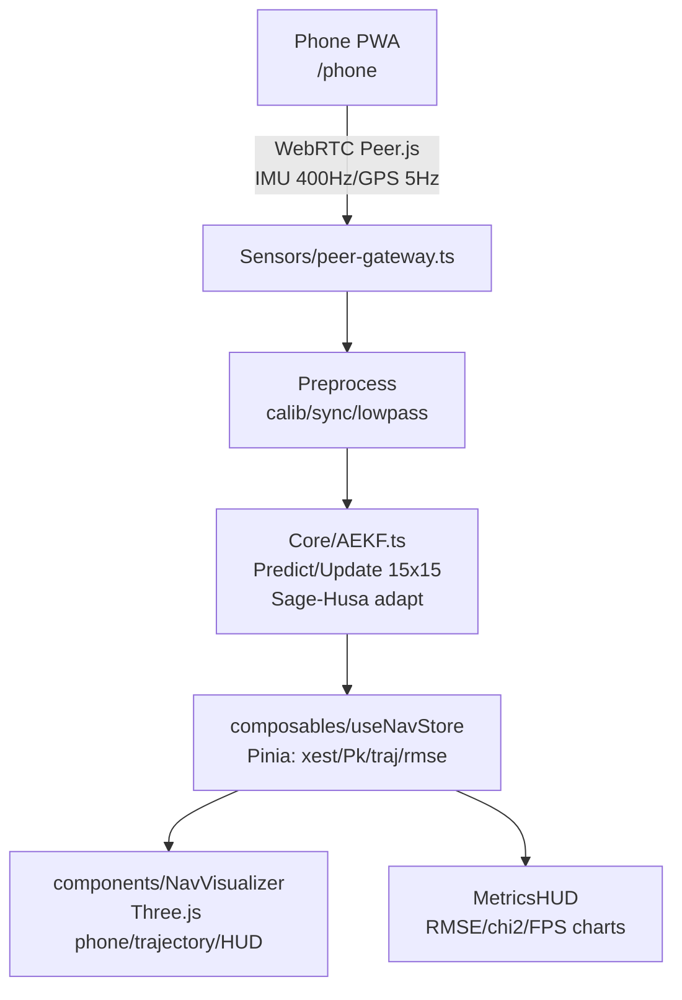

# 🚀 PROJECT SPEC: Indoor Navigation AEKF [версия: 1.0 | дата: YYYY-MM-DD]

## 🎯 Цель проекта

Реал-тайм indoor navigation на WebRTC + AEKF (15x15 states: pos/vel/att/bias).

- **PC**: 3D визуализация (Three.js 60 FPS), метрики (RMSE, chi2, FPS), dashboard.
- **Phone**: Standalone PWA сенсор (IMU/GPS stream 400Hz via Peer.js).
- Метрики успеха: Latency <50ms, RMSE <2m, FPS>50, PWA install 1-click.  
  **Пользователи**: Frontend devs (Vue/Nuxt), mobile testers (iOS/Android/PC). [file:1]

## 🏗️ Архитектура (High-Level)



**Data Flow**: Phone → Peer → EKF predict(400Hz) → gate GPS → update → Viz 60 FPS. [file:1]

## 📁 Структура файлов (строго соблюдать)

/
├── nuxt.config.ts (PWA, ssr:false)
├── app.vue (PC dashboard)
├── pages/phone/page.vue (mobile sensor)
├── composables/useNavStore.ts (Pinia state)
├── components/
│ ├── SensorPanel.vue (connect input)
│ ├── NavVisualizer.vue (Three canvas)
│ └── MetricsHUD.vue (live metrics)
├── core/ (math)
│ ├── matrix.ts (multiply/inverse/eye)
│ ├── aekf.ts (15x15 filter)
│ └── robust.ts (chi2/gate)
├── sensors/peer-gateway.ts (WebRTC conn)
├── types/index.ts (StateVector/IMUData)
└── public/ (PWA icons)

**Auto-imports**: Только composables/, components/, utils/. Custom (core/) — manual import. [file:1]

## 🛠️ Tech Stack & Зависимости

- **Framework**: Nuxt 4 (Vue 3 Composition API, TS).
- **Core**: Three.js (3D 60FPS), Peer.js (WebRTC P2P), Pinia (store).
- **Scripts**: `npm run dev` (localhost:3000), `npm run generate` (GitHub Pages).
- **Build**: es2020 target, tree-shaking. Size: ~250KB gzipped. [file:1]

## 🔧 Правила изменений (AI: строго следуй!)

- **✅ Разрешено**:
    1. Добавь sensor (UWB/Vision): `store.sensors.push(new UWBModule())`.
    2. Оптимизируй EKF (adapt Qk): Только в `aekf.ts predict/update`.
    3. Новые метрики: В `MetricsHUD.vue` + store getter.
    4. UI: Только Vue Composition API, reactive refs.
- **⚠️ Спроси сначала**:
    - Изменение state vector (15→21 dims)? Обнови types/matrix/aekf.
    - Новый роут? Только под /phone-xxx.
- **🚫 Запрещено**:
    - SSR on (WebRTC/Three.js client-only).
    - React/Svelte (только Vue/Nuxt).
    - Backend (pure frontend PWA).
    - Break PWA (manifest в nuxt.config).
- **Изменения**: 1) Update этот SPEC.md. 2) Код. 3) `npm run dev` тест. 4) Commit с `[SPEC v1.1]`. [web:19][web:20]

## 📊 Key Interfaces (не меняй без SPEC update)

```ts
interface StateVector {
	pos: [x, y, z];
	vel: [x, y, z];
	att: [roll, pitch, yaw];
	biasAcc: [x, y, z];
	biasGyro: [x, y, z];
} // 15 elems
interface IMUData {
	accel: [x, y, z];
	gyro: [x, y, z];
	ts: number;
}
```

**Constants**: DT=0.01, CHI2_PFA=0.001, GATE_THRESH=5.0. [file:1]

## 🧪 Тестирование & Деплой

- **Локально**: PC:3000, Phone:/phone → Connect ID → IMU stream → 3D track.
- **Метрики**: RMSE<2m, FPS>50, mem<100MB iPhone13.
- **Деплой**: `npm run generate` → GitHub Pages (/ и /phone PWA).
- **Тесты**: vitest EKF unit (aekf.test.ts), Playwright e2e WebRTC. [file:1]

## 📝 Change Log

| Дата       | Изменение             | Автор |
| ---------- | --------------------- | ----- |
| 2026-04-13 | Initial AEKF+Three.js | You   |
|            |                       |       |

## 🤖 AI Instructions (для агентов вроде Perplexity)

Читай этот файл перед правками. Спрашивай уточнения по ⚠️. Предлагай изменения в PR-style: diff + новый SPEC.md. Генерируй только TS/Vue код, compatible с Nuxt 4 PWA. [web:12][web:20]
